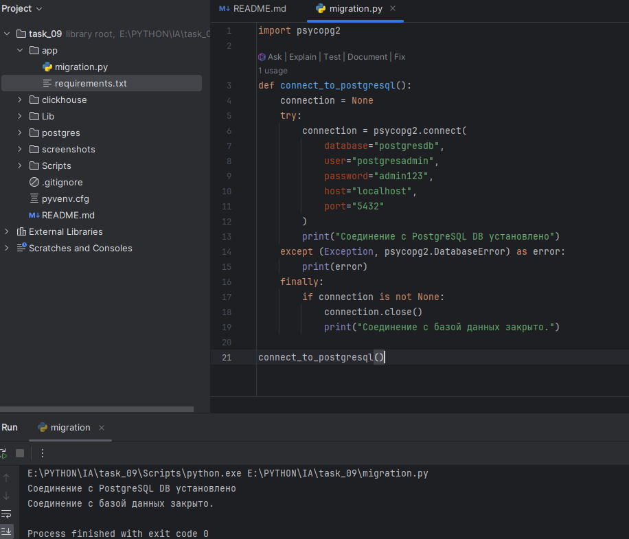

# Итоговая аттестация Задание 9.


## Миграция данных из PostgreSQL в ClickHouse в Minikube

## Цель:
Научиться развертывать PostgreSQL и ClickHouse в Kubernetes с использованием Minikube, и реализовать процесс миграции данных из PostgreSQL в ClickHouse.

## Описание задания и выполнение:

### 1. Запустите Minikube с достаточными ресурсами.

  ```minikube start --driver=docker --memory 8g --cpus 4```

  

### 2. Создайте файл postgres-deployment.yaml для развертывания PostgreSQL.
   
   1. Используем конфигурационные карты для хранения информации, связанной с PostgreSQL. Здесь мы используем базу данных, пользователя и пароль в конфигурационной карте, которые будут использоваться модулем PostgreSQL в шаблоне развертывания. ./postgres/postgres-configmap.yaml 
   
      ```kubectl create -f ./postgres/postgres-configmap.yaml```

   2. Контейнеры Docker недолговечны по своей природе. Все данные, которые генерируются контейнером или находятся в нем, будут потеряны после завершения работы экземпляра контейнера. Чтобы сохранить данные, используем постоянные тома и ресурс persistent volume claim в Kubernetes для хранения данных в постоянных хранилищах. Здесь используем локальный каталог/path в качестве ресурса постоянного хранилища (/mnt/data). ```./postgres/postgres-storage.yaml```

      ```kubectl create -f ./postgres/postgres-storage.yaml```

   3. В манифесте PostgreSQL для развертывания контейнера PostgreSQL используется образ PostgreSQL 10.4. В нем используется конфигурация PostgreSQL, такая как имя пользователя, пароль, имя базы данных из configmap, которую мы создали ранее. Он также монтирует том, созданный из постоянных томов, и утверждает, что данные контейнера PostgreSQL сохраняются. Файл создали /postgres/postgres-deployment.yaml
   
      ```kubectl create -f ./postgres/postgres-deployment.yaml```

   4. Чтобы получить доступ к развертыванию или контейнеру, нам нужно предоставить доступ к сервису PostgreSQL. С помощью ClusterIP мы можем получить доступ к сервису PostgreSQL в Kubernetes. NodePort предоставляет возможность предоставлять доступ к конечной точке сервиса на узлах Kubernetes. Для внешнего доступа к PostgreSQL нам необходимо использовать тип сервиса балансировщика нагрузки, который предоставляет доступ к сервису извне. ```./postgres/postgres-service.yaml```
   
      ```kubectl create -f ./postgres/postgres-service.yaml```
   5. Для подключения PostgreSQL нам нужно получить порт узла из развертывания сервиса.
   
      ```kubectl get svc postgres```
   
      
   
   6. Нам нужно использовать порт 31632 для подключения к PostgreSQL с компьютера/узла, присутствующего в кластере kubernetes, с учетными данными, указанными ранее в configmap.
   
   7. Пробросим порты для доступа к PostgreSQL
   
      ```kubectl port-forward svc/postgres 5432:5432```
   
      

   8. Удаление ресурсов

       > kubectl delete service postgres
       > 
       > kubectl delete deployment postgres
       > 
       > kubectl delete configmap postgres-config
       > 
       > kubectl delete persistentvolumeclaim postgres-pv-claim
       > 
       > kubectl delete persistentvolume postgres-pv-volume

### 3. Создайте файл clickhouse-deployment.yaml для развертывания ClickHouse.

  1. Cоздаем пространство имен: ```kubectl create ns clickhouse```

  2. PersistentVolumes 
 
     > не просто механизм хранения данных. Это продуманный и гибкий инструмент, который позволяет администраторам и разработчикам сосредоточиться на своей основной работе, не беспокоясь о данных. Они обеспечивают уровень абстракции и управления, который делает работу с хранилищем не только возможной, но и эффективной.
        
     ```kubectl apply -f ./clickhouse/clickhouse-pv.yaml```

     ```kubectl apply -f ./clickhouse/clickhouse-pvc.yaml```

  3. Создаем конфигурацию: 

     ```kubectl apply -f ./clickhouse/clickhouse-configmap.yaml -n clickhouse```

  4. Создаем deployment:

     ```kubectl apply -f ./clickhouse/clickhouse-deployment.yaml -n clickhouse```

  5. Создаем сервис:

     ```kubectl apply -f ./clickhouse/clickhouse-service.yaml -n clickhouse```

  6. Создаем форвард портов:

     ```kubectl port-forward svc/clickhouse 8123:8123 -n clickhouse```

  7. При наличии ошибок, смотрим логи:

     ```kubectl describe pod clickhouse-574b698c5b-dc55p -n clickhouse```

  8. Смотрим состояние всего пространсвта имен:
 
     ```kubectl get all -n clickhouse```

  9. Проверяем соединение из вне
     

### 4. Подключитесь к PostgreSQL с помощью psql.
  

### 5. Выполните следующие SQL-запросы для создания таблицы и добавления данных:
  > # SQL-запрос PostgreSQL
  > 
  > CREATE TABLE users (
  > 
  > id SERIAL PRIMARY KEY,
  >
  >  name VARCHAR(100),
  >
  >  age INT,
  >
  >  salary INT
  >
  >  );
  >
  >  INSERT INTO users (name, age, salary) VALUES
  >
  >  ('Alice', 30, 70000),
  >
  >  ('Bob', 25, 50000),
  >
  >  ('Charlie', 35, 100000),
  >
  >  ('David', 40, 120000),
  >
  >  ('Eve', 28, 60000),
  >
  >  ('Frank', 50, 150000);

  

### 6. Подключитесь к ClickHouse с помощью clickhouse-client.
  Вот тут я сел( пришлось подключаться через DBeaver 
  > ClickHouse может работать на любой операционной системе Linux, FreeBSD или Mac OS X с архитектурой процессора x86-64, AArch64 или PowerPC64LE.

  Но позже нашел способ PowerShell -> ```wsl --install```
  

  не вариант(

### 7. Выполните следующий SQL-запрос для создания таблицы в ClickHouse:
  > # SQL-запрос PostgreSQL
  > 
  > CREATE TABLE users (
  > 
  >   id UInt32,
  > 
  >   name String,
  > 
  >   age UInt8,
  > 
  >   salary UInt32
  > 
  > ) ENGINE = MergeTree()
  > 
  > ORDER BY id;

    

### 8. В локальной среде (не в Minikube) создайте файл migration.py.

 - Проверим соединение с PostgreSQL

  
 

### 9. Убедитесь, что PostgreSQL и ClickHouse доступны через портфорвардинг, и запустите скрипт, который перенесет данные из PG в ClickHouse.
 
  

> Решение на python не совсем изящное(даже вообще в помойку), проблема с библиотеками коннекта с clickhouse. Данное решение не контролирует записи которые есть в clickhouse и при сбое нужно будет таблицу clickhouse чистить и снова начинать 
> 
> Как варинат использовать консольные команды импорта из базы данных Postgresql и экспорта в clickhouse

> В качестве решения, разместите в репозитории 2 yaml-файла развертывания БД, файл migration.py, а также сделайте скриншоты того, что в ClickHouse данные появились.

## Результат задания
После выполнения задания у вас будет развернут Minikube-кластер с PostgreSQL и ClickHouse, настроена миграция данных между этими системами и успешно завершен процесс миграции. 

